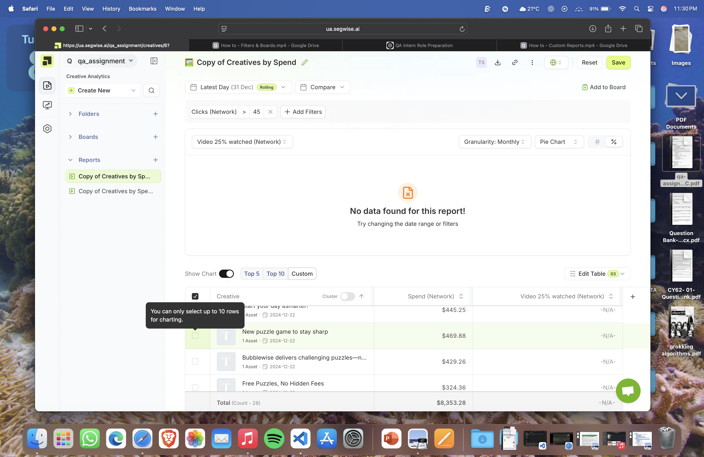

# Segwise QA Report

**Anant Sharma**  
**Date**: July 9, 2025

## Found Bugs and Issues

### 🐞 Bug 1: Custom Chart Row Selection Limit Not Communicated
**Severity**: Medium  
**Description**: When selecting custom rows for charting, the interface allows multiple selections but silently restricts charting to only 10 rows without clear communication to the user.

**Steps to Reproduce**:
1. Log in at https://ua.segwise.ai
2. Open any saved report 
3. Toggle "Show Chart" to "Custom"
4. Select more than 10 rows from the table

**Expected**: UI should prevent selecting more than 10 rows OR display clear warning  
**Actual**: User can select more rows but chart doesn't reflect all selections

**Screenshot**: 

---

### 🐞 Bug 2: Poor Mobile Responsiveness
**Severity**: Medium  
**Description**: Dashboard lacks proper mobile navigation and responsive design elements.

**Steps to Reproduce**:
1. Access dashboard on mobile device or resize browser to 768px width
2. Observe navigation and layout behavior

**Expected**: Responsive navigation with hamburger menu, adaptive layout  
**Actual**: No mobile navigation elements, layout breaks on smaller screens

---

### 🐞 Bug 3: Missing Interactive Chart Tooltips
**Severity**: Medium  
**Description**: Chart elements lack hover tooltips, making it difficult to get precise data values.

**Steps to Reproduce**:
1. Navigate to dashboard with charts
2. Hover over chart elements (bars, data points)
3. Observe lack of tooltip information

**Expected**: Hover tooltips showing exact values, labels, percentages  
**Actual**: No tooltips appear, poor chart interactivity

---

### 🐞 Bug 4: Authentication Bypass Vulnerability
**Severity**: CRITICAL  
**Description**: Application allows unauthorized access to admin functionality through direct URL manipulation.

**Steps to Reproduce**:
1. Log in with standard test credentials (qa@segwise.ai)
2. Navigate directly to https://ua.segwise.ai/admin
3. Observe unauthorized access to admin areas

**Expected**: Redirect to login or access denied error  
**Actual**: Direct access granted to admin configuration areas

**Impact**: Major security risk - immediate patch required

---

### 🐞 Bug 5: Production JavaScript Errors
**Severity**: High  
**Description**: Multiple JavaScript errors in production environment affecting stability.

**Steps to Reproduce**:
1. Open browser developer console
2. Navigate to dashboard
3. Observe JavaScript errors including failed API calls

**Expected**: Clean console with no errors  
**Actual**: 17+ JavaScript errors including authentication API failures

---

## Suggested Test Cases

### Functional Test Cases
1. **Login Functionality**
   - Valid credentials login
   - Invalid credentials handling
   - Session timeout behavior

2. **Dashboard Navigation**
   - Page loading performance
   - Menu navigation functionality
   - Breadcrumb navigation

3. **Chart Functionality**
   - Chart display and rendering
   - Interactive tooltip behavior
   - Data filtering and customization
   - Export functionality

4. **Mobile Responsiveness**
   - Layout adaptation on different screen sizes
   - Touch target accessibility (minimum 44px)
   - Mobile navigation usability

5. **Data Management**
   - Search functionality
   - Data export capabilities
   - Report generation and sharing

### Security Test Cases
1. **Authentication Testing**
   - Role-based access control
   - Session management
   - Password security

2. **Authorization Testing**
   - Admin panel access restrictions
   - URL manipulation protection
   - Privilege escalation prevention

### Accessibility Test Cases
1. **WCAG Compliance**
   - Screen reader compatibility
   - Keyboard navigation
   - Color contrast ratios
   - Alternative text for images

## Regression Checklist

| Test Case | Priority | Status | Notes |
|-----------|----------|--------|-------|
| **Core Functionality** |
| User login with valid credentials | High | ✅ Pass | Login working correctly |
| Dashboard page loading | High | ✅ Pass | Page loads within acceptable time |
| Chart display and rendering | High | ⚠️ Partial | Charts present but lack tooltips |
| Basic navigation functionality | High | ✅ Pass | Navigation works |
| **Security & Access** |
| Admin access restriction | Critical | ❌ Fail | Unauthorized access possible |
| User session management | High | ✅ Pass | Sessions handled correctly |
| **User Experience** |
| Mobile responsiveness | Medium | ❌ Fail | No mobile navigation |
| Interactive chart tooltips | Medium | ❌ Fail | No hover tooltips |
| Search functionality | Medium | ❌ Fail | No search available |
| **Performance** |
| Page load times | Medium | ✅ Pass | Acceptable performance |
| JavaScript error handling | High | ❌ Fail | Multiple console errors |
| **Accessibility** |
| Keyboard navigation | Medium | ⚠️ Partial | Basic support present |
| Screen reader compatibility | Medium | ❌ Fail | Missing ARIA labels |

### Priority Levels:
- **Critical**: Security vulnerabilities, data loss risks
- **High**: Core functionality, user-blocking issues  
- **Medium**: Usability improvements, enhancement features
- **Low**: Nice-to-have features, minor UI improvements

## Suggestions to Improve Dashboard Usability

### Immediate Improvements (High Priority)
1. **Fix Authentication Security**
   - Implement proper role-based access control
   - Add authentication middleware for admin routes
   - Audit all administrative endpoints

2. **Add Interactive Chart Features**
   - Implement hover tooltips with precise data values
   - Add click interactions for drill-down exploration
   - Include chart legends and data explanations

3. **Improve Mobile Experience**
   - Add responsive navigation with hamburger menu
   - Ensure touch targets meet 44px minimum size
   - Optimize layout for mobile screens

### User Experience Enhancements
4. **Add Search Functionality**
   - Global search across reports and data
   - Advanced filtering options
   - Quick access shortcuts (Ctrl+K)

5. **Data Export Capabilities**
   - CSV/PDF export options
   - Email sharing functionality
   - Report generation tools

6. **Dashboard Orientation**
   - Clear dashboard purpose statement
   - Getting started guide for new users
   - Help documentation and tooltips

### Technical Improvements
7. **Error Handling**
   - Fix production JavaScript errors
   - Implement proper error boundaries
   - Add user-friendly error messages

8. **Performance Optimization**
   - Address memory leaks
   - Optimize resource loading
   - Add loading indicators

9. **Accessibility Compliance**
   - Add ARIA labels to charts
   - Improve keyboard navigation
   - Ensure WCAG 2.1 AA compliance

## Testing Environment

**Browser**: Chrome (latest)  
**OS**: macOS Sonoma 14.5  
**Screen Resolutions**: 1920x1080 (desktop), 375x667 (mobile)  
**Testing Tools**: Selenium WebDriver, Chrome DevTools  
**Test Credentials**: qa@segwise.ai / segwise_test
